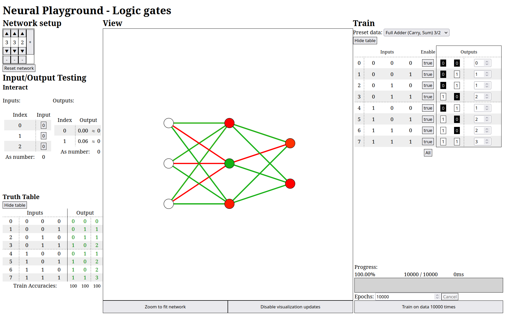
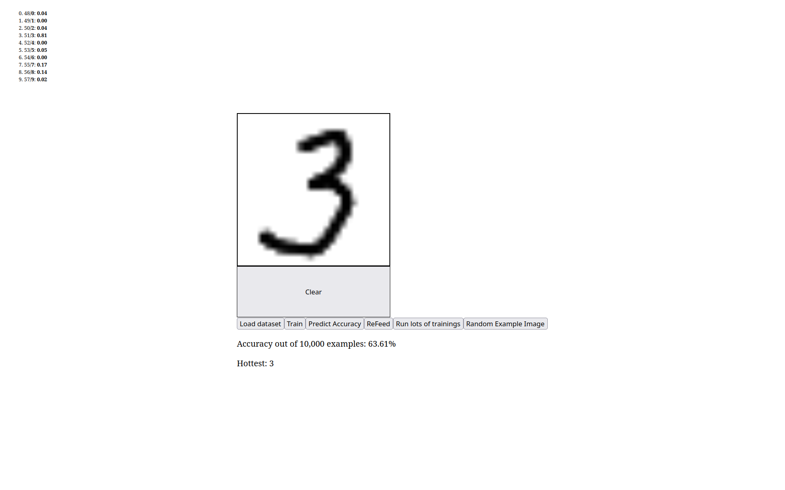

# Neural Playground

<b><i>Neural Playground</i></b> allows users to interact with simple feed-forward neural networks to intuitively see how they improve as they learn more - with learning taking place entirely within the browser in pure Typescript.

Neural Playground is currently in a very early stage of development, with limited interactivity. While the network systems powering Neural Playground can be used on any arbitrary data, logic gate truth tables are used for demonstration purposes, since they are small, easily verifiable datasets. Networks can become 100% accurate within seconds of training, making for good visual feedback.



Eventually, Neural Playground will also support larger datasets, such as the EMNIST dataset. A proof-of-concept that allows the user to draw on a canvas as input is included in the repository.



## Project setup
```
npm install
```

### Compiles and hot-reloads for development
```
npm run serve
```

### Compiles and minifies for production
```
npm run build
```

### Lints and fixes files
```
npm run lint
```

### Customize configuration
See [Configuration Reference](https://cli.vuejs.org/config/).
